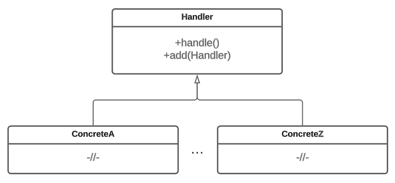

# Цепочка обязанностей

## Назначение

Паттерн Цепочка обязанностей (Chain of Responsibility) – это поведенческий шаблон проектирования, который позволяет создать цепочку объектов-обработчиков. Паттерн не требует связи запроса с конкретным объектом и методом, а несет в себе только данные запроса. Каждый обработчик знает, какой объект он может обработать. Если обработчик не может совершить действие над запросом, он передаёт его следующему, пока один из обработчиков не сможет обработать запрос. Используется, когда нужно предоставить различные варианты обработки запросов или когда необходимо динамически изменять порядок обработки.


Примером системы, использующей этот паттерн может быть система обработки запросов клиентов в банке. Запросы могут быть разного типа (запрос на открытие счета, запрос на получение кредита и т. д.). Каждый тип запроса может иметь свои собственные правила и условия обработки.


## Решаемые задачи

* Разделение ответственности.

Паттерн позволяет разделить логику обработки запросов на отдельные объекты. Каждый объект имеет свою конкретную обязанность.

* Избавление от жесткой зависимости объекта и действия над ним.

Клиентский код не зависит от конкретных обработчиков и их порядка в цепочке. Он просто передает запрос в начало цепочки, и дальнейшая обработка происходит автоматически.

## UML диаграмма

<figure><figcaption>
UML диаграмма паттерна "Цепочка обязанностей"
</figcaption></figure>

## Преимущества

1. Возможность легко встроить новый объект обработчик в цепь.
2. Запрос может обрабатываться несколькими объектами. Каждый обработчик выполняет свою часть работы и может изменять или расширять данные запроса перед передачей его следующему обработчику.
3. Запрос не связан конкретным объектом или методом.

## Недостатки

1. Если нужный обработчик не был найден, то запрос игнорируется.
2. Требуется реализация сущности, ответственной за принятие решений о создании, удалении и упорядочивании обработчиков в списке.
3. Производительность системы ухудшается, если запросу нужно пройти через большое количество лишних обработчиков.

## Связь с другими паттернами.

1. Паттерн может использоваться вместе с паттерном [Компоновщик](../../structural-patterns/composite/) для создания иерархической структуры объектов-обработчиков. Обработчики могут быть объединены в древовидную структуру, где каждый [узел](../../structural-patterns/composite/#svyaz-s-drugimi-patternami) может быть либо цепочкой обработчиков, либо конкретным обработчиком.
2. Паттерн может быть комбинирован с паттерном [Декоратор](../../structural-patterns/dekorator/) для добавления дополнительной функциональности к обработчикам в цепочке. Декораторы могут обернуть обработчики и добавить новую функциональность без изменения их базового поведения.
3. Паттерн может работать вместе с паттерном [Стратегия](../strategy/) для определения различных способов обработки запросов. Обработчики могут быть реализованы в виде стратегий, которые могут быть выбраны и заменены во время выполнения программы.
