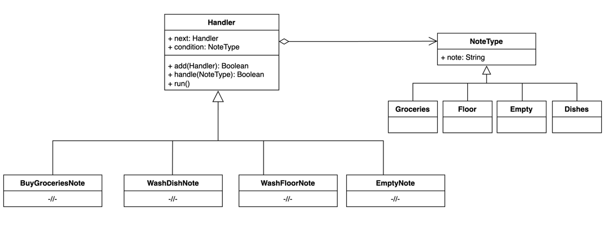

# Реализации на Kotlin

## UML диаграмма

<figure><figcaption><p>UML диаграмма для общей реализации паттерна "Цепочка обязанностей" на Kotlin</p></figcaption></figure>

## Общая реализация на языке Kotlin




```kotlin
abstract class Handler {

    abstract var next: Handler?
    abstract var condition: NoteType

    abstract fun run(): Boolean

    fun add(note: Handler): Boolean {
        return when (next?.condition) {
            is NoteType.Empty -> {
                next = note
                true
            }
            else -> next?.add(note) == true
        }
    }

    fun handle(message: NoteType): Boolean =
        if (condition.note == message.note) {
            run()
        } else {
            next?.handle(message) == true
        }
}
```





```kotlin
sealed class NoteType(val note: String) {
    data object Groceries : NoteType("Buy groceries")
    data object Floor : NoteType("Wash the floor until you cry")
    data object Empty : NoteType("")
    data object Dishes : NoteType("Wash the dishes")
}
```





```kotlin
class BuyGroceriesNote() : Handler() {
    override var condition: NoteType = NoteType.Groceries
    override var next: Handler? = EmptyNote()

    override fun run(): Boolean {
        println(condition.note)
        return true
    }
}
```





```kotlin
class WashFloorNote() : Handler() {
    override var condition: NoteType = NoteType.Floor
    override var next: Handler? = EmptyNote()

    override fun run(): Boolean {
        println(condition.note)
        return true
    }
}
```





```kotlin
class EmptyNote() : Handler() {
    override var condition: NoteType = NoteType.Empty
    override var next: Handler? = null

    override fun run(): Boolean {
        println(condition.note)
        return true
    }
}
```





```kotlin
class WashDishNote() : Handler() {
    override var condition: NoteType = NoteType.Dishes
    override var next: Handler? = EmptyNote()

    override fun run(): Boolean {
        println(condition.note)
        return true
    }
}
```





```kotlin
fun main() {
    val chain = BuyGroceriesNote()
    chain.add(WashDishNote())
    chain.add(WashFloorNote())

    chain.handle(NoteType.Floor)
}
```

