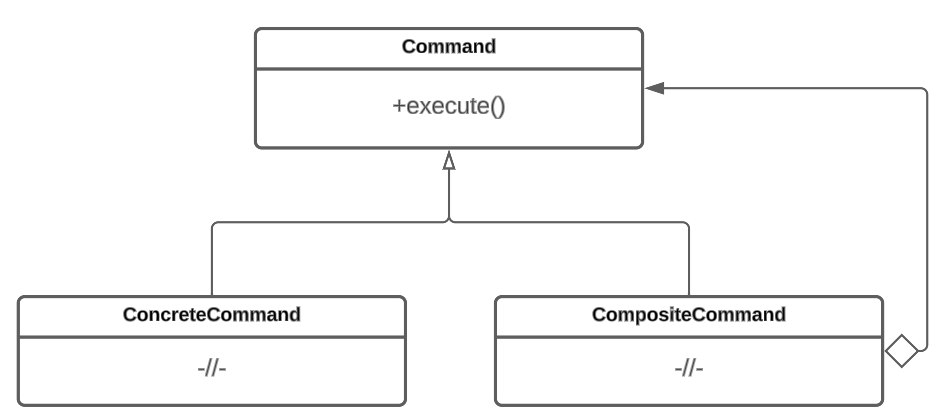

# Команда

## Назначение

Паттерн Команда (Command) — это поведенческий шаблон проектирования, который позволяет инкапсулировать запрос на выполнение действия в виде отдельного объекта. Создается абстрактный интерфейс, который определяет метод, используемый для выполнения команд. Каждая конкретная команда реализует этот интерфейс и предоставляет свою собственную реализацию метода, соответствующую своей операции. Используется когда необходимо управлять последовательным выполнением действий над объектом.

## Решаемые задачи

* Организация очереди или журнала действий

Паттерн позволяет создавать очередь запросов или вести журнал действий. Появляется возможность добавлять команды в очередь в определенном порядке, а затем последовательно их вызывать.

* Разделение ответственностей

Паттерн позволяет разделить логику выполнения операций от объектов, которые инициируют эти операции. Различные компоненты системы, которые требуют выполнения определенных операций, не знают о деталях реализации этих операций. Они работают с абстрактным интерфейсом, который определяет метод для выполнения действия, а конкретные команды реализуют этот интерфейс.

* Реализация набора действий над объектом

Появляется возможность создавать набор операций над объектом: операция выполнения, отмены и повтора действия.

## UML диаграмма

<figure><figcaption>
UML диаграмма паттерна "Команда"
</figcaption></figure>

## Преимущества

1. Уменьшение зависимости между объектами. Это связано с тем, что объекты-инициаторы не привязаны напрямую к объектам, которые выполняют операции.
2. Возможность формирования очереди команд.
3. Унификация обработки событий или запросов к системе. Паттерн повзоляет инкапсулировать операции в отдельные команды и предоставляет единый интерфейс для их обработки.

## Недостатки

1. Требуется изначально знать, кто может обработать команду и какое конкретное действие должно быть совершено.
2. По умолчанию команда выполняется только над одним объектом. Это связано с тем, что каждая команда инкапсулирует конкретное действие и ссылается на конкретный объект-получатель для его выполнения. Однако, если требуется, чтобы команда была выполнена над несколькими объектами, то можно столкнуться с ограничениями: усложнение логики команды, обработка конфликтов и т.д.
3. Увеличение количества и усложнение структуры кода за счет появления новых иерархий классов.

## Связь с другими паттернами

* Паттерн [Цепочка обязанностей](../chain-of-responsibility/) может использоваться вместе с паттерном команда. Цепочка обязанностей позволяет создать цепочку объектов-обработчиков, где каждый объект может обработать команду или передать ее следующему объекту в цепочке.
* Используя паттерн [Компоновщик](../../structural-patterns/composite/), можно создавать сложные команды, состоящие из нескольких простых команд или даже других составных команд. Это позволяет строить иерархические структуры команд.
* Паттерн [Фабричный метод](../../creationals-patterns/abstract-factory/) может быть использован для создания различных типов команд. Фабричный метод может инкапсулировать процесс создания команды и предоставить подклассам возможность создавать конкретные команды в соответствии с требованиями системы.
