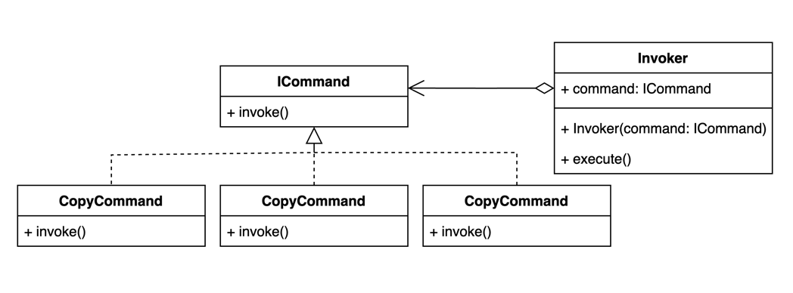

# Реализации на Kotlin

## UML диаграмма

<figure><figcaption><p>UML диаграмма для общей реализации паттерна "Команда" на Kotlin</p></figcaption></figure>

## Общая реализация на языке Kotlin




```kotlin
fun interface ICommand {
    operator fun invoke()
}
```





```kotlin
class CopyCommand : ICommand {
    override operator fun invoke() {
        println("Copying document.")
    }
}
```





```kotlin
class PrintCommand : ICommand {
    override operator fun invoke() {
        println("Printing document.")
    }
}
```





```kotlin
class ScanCommand : ICommand {
    override operator fun invoke() {
        println("Scanning document.")
    }
}
```





```kotlin
class Invoker(var command: ICommand) {
    fun execute() {
        println("Executing...")
        command()
    }
}
```





```kotlin
fun main() {
    val copyCommand = CopyCommand()
    val scanCommand = ScanCommand()
    val printCommand = PrintCommand()

    val printer = Invoker(copyCommand)
    printer.execute()

    printer.command = scanCommand
    printer.execute()

    printer.command = printCommand
    printer.execute()
}
```

