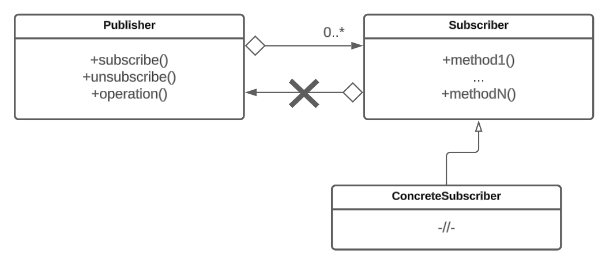

# Подписчик-издатель

Паттерн Подписчик-издатель (Publisher-subscriber) – поведенческий шаблон проектирования, позволяющий установить зависимость между объектами таким образом, чтобы при изменении состояния одного объекта (Издателя) все зависимые от него объекты (Подписчики) автоматически уведомлялись и обновлялись. У издателя определены методы подписки/отписки на изменения его состояния. Используется, когда часто надо передавать какое-то обновление многим объектам на этапе выполнения программы.

## Решаемые задачи

* Уведомление об изменениях

Паттерн позволяет объектам автоматически уведомлять друг друга о произошедших изменениях или событиях, что помогает поддерживать согласованность данных между объектами.

* Разделение ответственностей

Паттерн позволяет отделить логику обработки событий от объектов, генерирующих эти события.

## UML диаграмма

<figure><figcaption>
UML диаграмма паттерна "Подписчик-издатель"
</figcaption></figure>

## Преимущества

1. Издатели не зависят от конкретных подписчиков и могут отправлять уведомления или запросы без прямой зависимости от них.
2. Подписчики могут подписаться/отписаться на издателя во время исполнения программы.

## Недостатки

1. Возможна утечка памяти при циклической зависимости.


Циклическая зависимость происходит когда объект A подписывается на уведомления объекта B, а объект B в свою очередь подписывается на уведомления объекта A. Это означает, что каждый объект ссылается на другой объект, и они не могут быть удалены из памяти, так как они всегда ссылаются друг на друга. Такая ситуация может привести к утечке памяти, поскольку объекты будут продолжать существовать в памяти, даже если они больше не нужны.


2. Произвольный порядок оповещения подписчиков.
3. Необходимость держать список подписчиков. Издатели должны хранить список своих подписчиков для того, чтобы иметь возможность отправлять им уведомления или запросы. При удалении издателя, необходимо отписать всех подписчиков из списка, чтобы избежать утечек памяти и нежелательного взаимодействия.

## Связь с другими паттернами

1. Паттерн [Фасад](../../structural-patterns/facade/) может быть использован для создания удобного интерфейса для взаимодействия с паттерном. Фасад может скрыть сложности подписки, отписки и уведомлений, предоставляя простой интерфейс для взаимодействия с издателями и подписчиками.
2. Паттерн [Посредник](../mediator/) может быть использован вместе с паттерном для управления сложными взаимодействиями между объектами. Посредник может выступать в роли издателя, а другие объекты могут быть подписчиками, взаимодействуя через посредника.
3. Паттерн [Цепочка обязанностей](../chain-of-responsibility/) может быть использован для обработки уведомлений, полученных от издателей. Каждый объект в цепочке может быть подписчиком, который обрабатывает уведомления, а затем передает их следующему объекту в цепочке, если не может обработать сам.
