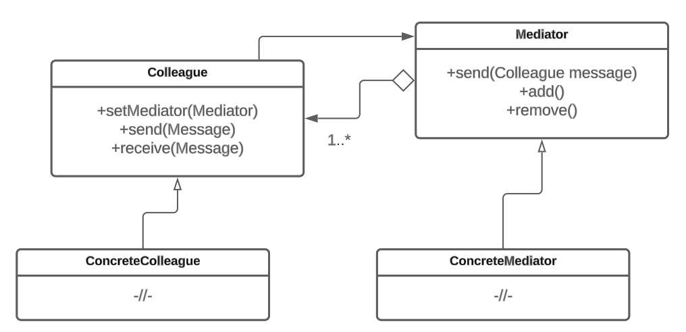

# Посредник

## Назначение

Паттерн Посредник (Mediator) – это поведенческий шаблон проектирования, который используется для упрощения взаимодействия между объектами путем вынесения логики их взаимодействия в отдельный класс. Этот класс выступает в роли посредника, который контролирует и координирует взаимодействие между объектами, вместо того чтобы позволять им обмениваться информацией напрямую. Используется, когда имеется большое количество объектов, каждый из которых должен взаимодействовать с другими объектами, и прямое взаимодействие между всеми парами объектов становится сложным и запутанным.

## Решаемые задачи

* Упрощение взаимодействия между объектами

Паттерн обеспечивает централизованное взаимодействие между объектами, устраняя необходимость прямого взаимодействия между каждой парой объектов.

* Снижение зависимости между объектами

Паттерн позволяет объектам взаимодействовать друг с другом через абстрактный интерфейс, не зависящий от конкретных классов. Это позволяет объектам меняться независимо друг от друга, не затрагивая другие части системы.

* Избавление от лишней логики взаимодействия в классах

Появляется возможность очистить классы от избыточной логики, связанной с их взаимодействием. Вместо того чтобы каждый класс самостоятельно управлял своими зависимостями и коммуникацией с другими классами, эта логика выносится в посредник.

## UML диаграмма

<figure><figcaption>
UML диаграмма паттерна "Посредник"
</figcaption></figure>

## Преимущества

1. Устранение прямых зависимостей между объектами.
2. Уменьшение дублирования кода. Паттерн позволяет выделить поведение, которое должно быть общим для нескольких объектов, в отдельный класс посредника.
3. Расширяемость системы. Паттерн облегчает добавление новых объектов и изменение взаимодействия между ними. Новые объекты могут быть легко интегрированы в систему, а изменения взаимодействия между объектами могут быть внесены в посредника.

## Недостатки

1. Увеличение количества кода за счёт появления дополнительных иерархий классов.
2. Увеличение времени выполнения. Объекты отправляют сообщения посреднику, который затем передает их другим объектам. Этот дополнительный[ уровень косвенности](#user-content-fn-1)[^1] может привести к снижению производительности программы.

## Связь с другими паттернами

* Паттерн Посредник может быть реализован как [Одиночка](../../creationals-patterns/singleton/), чтобы гарантировать единственный экземпляр посредника в системе. Это обеспечивает централизованный контроль и управление взаимодействием между объектами.
* Паттерн Посредник может работать с паттерном [Стратегия](../strategy/) для динамического изменения поведения объектов. Посредник может выбирать различные стратегии, в зависимости от текущего состояния системы, и передавать их объектам для выполнения соответствующих действий.
* Паттерн посредник может использоваться вместе с паттерном [Цепочка обязанностей](../chain-of-responsibility/) для передачи запросов между объектами. Посредник может принимать запросы и передавать их по цепочке объектов, пока один из объектов не обработает запрос.

[^1]: Уровень косвенности означает количество промежуточных шагов, которые необходимо выполнить для достижения конечного результата.
