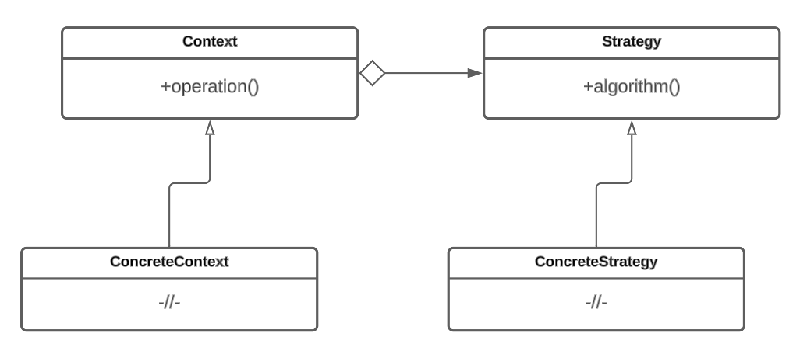

# Стратегия

## Назначение

Паттерн Стратегия (Strategy) – это поведенческий шаблон проектирования, который предназначен для определения реализации алгоритмов, инкапсуляции каждого из них и обеспечения их взаимозаменяемости. Это позволяет легко подменять и модифицировать алгоритмы во время выполнения программы без изменения класса, который их использует. Используется для того, чтобы клиентский код мог выбирать нужный вариант раелизации алгоритма в зависимости от контекста или условий. Каждый вариант реализации алгоритма выделяется в отдельную стратегию.


Примером такого алгоритма может быть алгоритм обработки заказов в интернет-магазине. В зависимости от способа доставки заказа (курьерская доставка, почта, самовывоз), нужно применить разные варианты расчета стоимости доставки.


## Решаемые задачи

* Разделение алгоритма на отдельные классы

Паттерн позволяет выделить различные варианты реализации алгоритма в отдельные классы, что упрощает структуру кода и делает его более модульным.

* Подмена алгоритма во время выполнения программы

Появляется возможность во время выполнения программы динамически выбирать и подменять нужную стратегию и передавать ее в основной класс для выполнения операции.

* Изменение поведения объекта

Паттерн позволяет изменять поведение объекта без изменения самого объекта или его наследников.

## UML диаграмма

<figure><figcaption>
UML диаграмма паттерна "Стратегия"
</figcaption></figure>

## Преимущества

1. Инкапсуляция реализации различных алгоритмов.
2. Вызов всех алгоритмов одним стандартным образом. Все конкретные стратегии реализуют общий интерфейс. Это позволяет вызывать все алгоритмы одним стандартным образом, независимо от конкретной стратегии.
3. Возможность подмены алгоритмов во время выполнения.

## Недостатки

1. Конкретная стратегия может не работать с данными определенного класса, что приводит к появлению зависимостей между конкретными сущностями и стратегиями.
2. Увеличение количества кода за счёт появления параллельных иерархий классов.

## Взаимодействие с другими паттернами

* Паттерн [Фабричный метод](../../creationals-patterns/factory-method/)может использоваться для создания объектов стратегий.
* Паттерн [Декоратор](../../structural-patterns/dekorator/) может использоваться для добавления дополнительного поведения или функциональности к конкретным стратегиям. Декоратор позволяет обернуть стратегию в другой объект и добавить ему дополнительные возможности, не изменяя саму стратегию.
* Паттерн [Команда](../command/) может использоваться для инкапсуляции вызова стратегии в отдельный объект команды. Команда может содержать ссылку на объект стратегии и вызывать его методы при выполнении команды. Это позволяет легко переключаться между разными стратегиями, используя различные команды.
