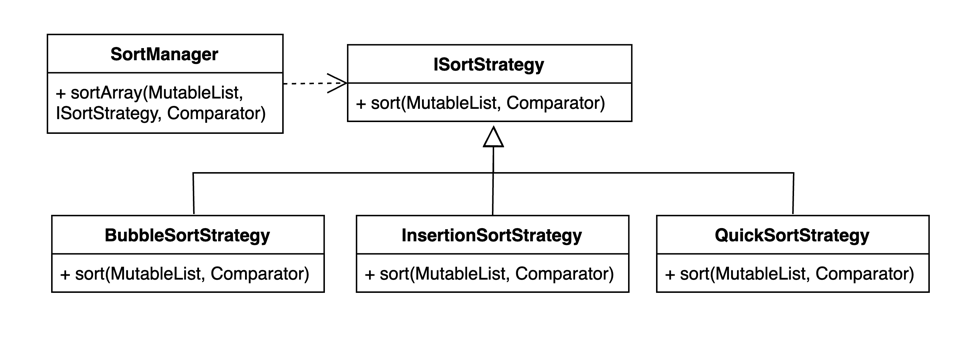

# Реализации на Kotlin

## UML диаграмма

<figure><figcaption><p>UML диаграмма для общей реализации паттерна "Стратегия" на Kotlin</p></figcaption></figure>

## Общая реализация на языке Kotlin




```kotlin
interface ISortStrategy<T> {
    fun sort(numbers: MutableList<T>, order: (T, T) -> Int)
}
```





```kotlin
class BubbleSortStrategy<T> : ISortStrategy<T> {
    override fun sort(numbers: MutableList<T>, order: (T, T) -> Int) {
        val size: Int = numbers.size

        for (i in 0..< size - 1) {
            for (j in 0..< size - i - 1) {
                if (order(numbers[j], numbers[j + 1]) > 0) {
                    val temp: T = numbers[j]
                    numbers[j] = numbers[j + 1]
                    numbers[j + 1] = temp
                }
            }
        }
    }
}
```





```kotlin
class InsertionSortStrategy<T> : ISortStrategy<T> {
    override fun sort(numbers: MutableList<T>, order: (T, T) -> Int) {
        val size: Int = numbers.size

        for (i in 1 ..< size) {
            val key: T = numbers[i]
            var j = i - 1

            while (j >= 0 && order(key, numbers[j]) > 0) {
                numbers[j + 1] = numbers[j]
                j -= 1
            }

            numbers[j + 1] = key
        }
    }
}
```





```kotlin
class QuickSortStrategy<T> : ISortStrategy<T> {
    override fun sort(numbers: MutableList<T>, order: (T, T) -> Int) {
        numbers.sortWith(order)
    }
}
```





```kotlin
class SortManager {
    fun <T> sortArray(
        list: MutableList<T>,
        strategy: ISortStrategy<T>,
        order: (T, T) -> Int
    ) {
        strategy.sort(list, order)
    }
}
```





```kotlin
fun main() {
    val nums1 = mutableListOf(3, 1, -2, 7, 19, -12)
    val nums2 = mutableListOf(3.2, 5.6, 1.2, 7.8)
    val nums3 = mutableListOf(2, 6, -1, 0, 5)
    val str = mutableListOf("some", "values", "from", "words", "dictionary")

    val sortManager = SortManager()

    sortManager.sortArray(nums1, BubbleSortStrategy()) { a: Int, b: Int -> a - b }
    println("Bubble sort integer: $nums1")

    sortManager.sortArray(nums2, QuickSortStrategy()) { a: Double, b: Double -> a.compareTo(b) }
    println("Quick sort double: $nums2")

    sortManager.sortArray(nums3, QuickSortStrategy()) { a: Int, b: Int -> a.compareTo(b) }
    println("Quick sort integer: $nums3")

    sortManager.sortArray(str, InsertionSortStrategy()) { a, b -> b.compareTo(a) }
    println("Insertion sort strings: $str")
}
```

