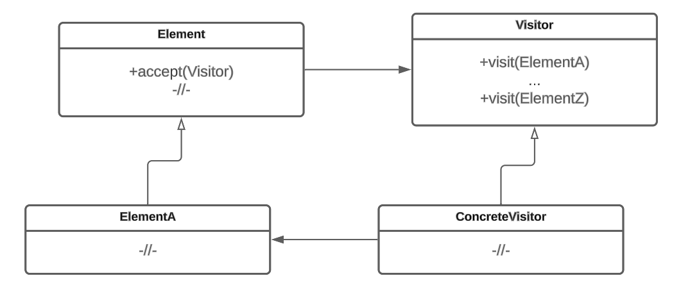

# Посетитель

## Назначение

Идея поведенческого паттерна проектирования посетитель (Visitor) заключается в объединении различных стратегий в одну иерархию и предоставлении возможности объектам принимать посетителей (visitors) для выполнения определенных операций.

Расширяется функциональность объектов без изменения их структуры.

Посетитель позволяет выполнить нужные действия в зависимости от типов объектов.

## Решаемые задачи

* возможность выполнять операции (зависящие от конкретных классов) над объектами многих классов с различными интерфейсами
* объединение родственных операций в один класс


Если структура объектов является общей для нескольких приложений, то паттерн посетитель позволит в каждое приложение включить только относящиеся к нему операции.


* определение новых операций без изменения классов
* разделение ответственности между классами: вынесение операций, находящихся в самих классах, в отдельные классы-посетители

## UML диаграмма

<figure><figcaption>
UML диаграмма паттерна "Посетитель"
</figcaption></figure>

## Преимущества

* объединение разных иерархий в одну (решение проблемы [стратегии](../strategy/))
* значительное упрощение схемы использования
* отсутствие оберточных функций (решение проблемы [адаптера](../../structural-patterns/adapter/))
* открытость кода для расширения: добавление новых классов-посетителей позволяет расширять функциональность без изменения существующего кода
* упрощение поддержки разных типов объектов

## Недостатки

* расширение иерархии, добавление новых классов приводит к необходимости модификации посетителей


Неудобство при добавлении новых типов объектов: требуется изменение всех классов посетителей.


* необходимость установления дружественных связей для обеспечения доступа к реализации


Посетитель получает доступ к внутреннему состоянию объекта, с которым взаимодействует. Это может привести к потенциальному раскрытию деталей реализации объектов и нарушению принципа инкапсуляции.


* проблема связи на уровне базовых классов


Происходит из-за сильной зависимости между посетителем и элементами, которые он посещает.


## Связь с другими паттернами

* [Компоновщик](../../structural-patterns/composite/): посетители могут использоваться для выполнения операции над всеми объектами структуры, определенной с помощью паттерна компоновщик.
* [Посредник](https://github.com/NikkiWay/Git-Book-Patterns/blob/main/patterns/behavioral-patterns/opekun.md): посетитель может быть связан с паттерном посредник для обмена информацией между различными объектами в системе. Посредник может передавать посетителям необходимую информацию о состоянии объектов, чтобы они могли выполнить соответствующие операции.
* [Стратегия](../strategy/): посетитель может быть связан с паттерном стратегия для предоставления различных стратегий обработки элементов структуры. Посетитель может быть реализован как одна из стратегий, которая может быть выбрана во время выполнения в зависимости от требуемой операции.
