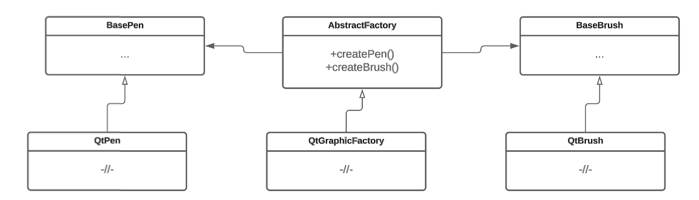

# Абстрактная фабрика

## Проблема

В процессе разработки программы может возникнуть необходимость создания иерархии разных классов, объекты которых должны использоваться совместно. Таким примером может являться система графики, в которой происходит взаимодействие множества компонентов: кистей, ручек, форм, канвасов.&#x20;

Фабричный метод не поддерживает связь между иерархиями классов. Например, нет возможности подменить одну графическую систему на другую. В таком случае возможным решением является объединение методов создания иерархий объектов разных классов в один класс.

## Назначение

Абстрактная фабрика(Abstract factory) — порождающий паттерн проектирования, определяющий единый интерфейс создания иерархий классов и позволяющий менять одно семейство связанных объектов на другое.&#x20;


Семейством связанных объектов могут быть, например, объекты конкретной графической подсистемы (brush, pen, marker, canvas).


### Решаемые задачи

* Возможность создавать и подменять одно семейство объектов на другое

Появляется возможность создавать семейства связанных объектов. При необходимости можно легко заменять или добавлять новые семейства объектов, не изменяя другие части кода, которые используют эти объекты.

* Отделение принятия решения о том, какое семейство объектов нужно создать, от самого процесса создания объектов семейства

Решение о выборе конкретного семейства принимается в части кода, который использует абстрактную фабрику. Во время выполнения этот код определяет, какое семейство связанных объектов требуется создать, и создает соответствующую фабрику. В коде через абстрактную фабрику вызываются методы создания объектов конкретных иерархий классов.

* Повторное использование объектов

Появляется возможность повторного использования уже созданных семейств объектов.

## UML диаграмма

<figure><figcaption>
UML диаграмма паттерна "Абстрактная фабрика"
</figcaption></figure>

## Преимущества

1. Избавление методов от привязки к конкретным классам, что решает проблему подмены объекта одного семейства класса на объект другого семейства классов.
2. Упрощение добавления новых семейств объектов без изменения написанного кода.
3. Возможность принимать решение, объект какого семейства создавать, и создавать объекты в разных местах программы.
4. Возможность принимать решение, объект какого семейства необходимо создавать, не во время компиляции, а во время выполнения программы.
5. Возможность во время выполнения программы подменять создание объекта одного семейства класса на объект другого класса.

## Недостатки

1. Увеличивается объем кода.
2. Увеличивается время компиляции.
3. Увеличивается время выполнения программы из-за использования полиморфизма.
4. Увеличивается количество требуемой памяти.
5. Требуется создание параллельных иерархий классов.
6. Необходимость перекомпилировать один и тот же код при добавлении новых типов объектов.
7. Семейства объектов должны быть однородны по своей структуре, иначе выделить базовую абстракцию в абстрактной фабрике будет невозможно.
8. Возможность наличия неполных семейств объектов.&#x20;

## Связь с другими паттернами

* Абстрактная фабрика может использовать [Фабричный метод](../factory-method/) для создания конкретных объектов. Вместо того, чтобы иметь только один метод для создания объектов, абстрактная фабрика может использовать фабричный метод в своей реализации.
* Абстрактная фабрика может быть комбинирована с паттерном [Строитель](../builder/) для создания сложных объектов.
