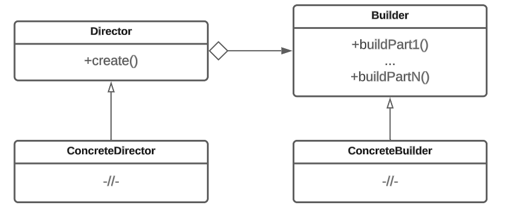

# Строитель

## Назначение

Строитель (Builder) — это порождающий паттерн проектирования, который позволяет создавать сложные объекты пошагово. Разбив процесс конструирования сложного объекта на отдельные шаги, паттерн позволяет создавать сложные объекты с различным набором параметров и настроек.


Примером сложного объекта может служить объект почтового сообщения Email. У этого объекта может быть множество параметров, таких как отправитель, получатель, тема, текст, вложения и т.д. Используя паттерн Строитель, можно поэтапно создать объект почтового сообщения с различными параметрами.


## Решаемые задачи

* Создание сложного объекта с различными вариантами конфигурации

Появляется возможность создавать сложные объекты пошагово с разными вариантами конфигурации. Каждый шаг строителя определяет значения и настройки для соответствующей части объекта.

* Отделение процесса контроля за созданием объекта от самого процесса создания объекта.

Одна сущность (строитель) определяет шаги конструирования объекта, в то время как другая сущность (директор) управляет последовательностью этих шагов, обеспечивая создание объекта с нужной конфигурацией.

## UML диаграмма

<figure><figcaption>
UML диаграмма паттерна "Строитель"
</figcaption></figure>

## Преимущества

1. Упрощение процесса создания сложных объектов.
2. Сокрытие сложной логики создания объекта.
3. Разделение процесса создания объекта и контроля за объектом.

## Недостатки

1. Усложнение кода из-за введения дополнительных иерархий классов.
2. Паттерн эффективен при создании сложных объектов с большим количеством настраиваемых параметров. Для простых объектов или объектов с небольшим количеством параметров, использование паттерна может быть излишним и привести к избыточности кода и увеличению времени исполнения.

## Связь с другими паттернами

1. Паттерн Строитель может использоваться вместе с [Абстрактной фабрикой](../abstract-factory/) для создания сложных объектов. "Абстрактная фабрика" определяет интерфейс для создания семейства взаимосвязанных объектов, а "Строитель" отвечает за создание отдельных частей сложного объекта.
2. Паттерн Строитель может использоваться вместе с [Одиночкой](../singleton/) для создания сложных объектов с гарантированной уникальностью.
3. Паттерн Строитель может быть использован внутри [Фасада](../../structural-patterns/facade/) для создания и настройки сложного объекта, скрывая детали его конструирования от клиентов.
