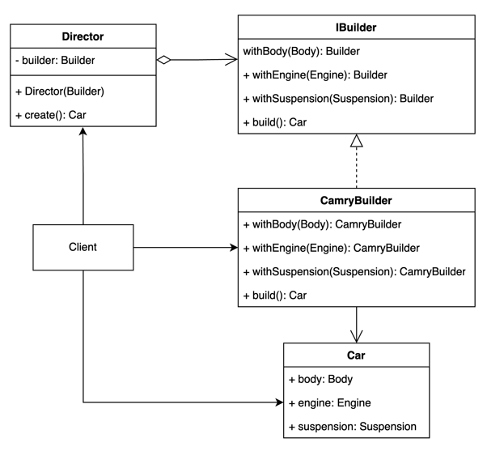

# Реализации на Kotlin

## UML диаграмма

<figure><figcaption><p>UML диаграмма для общей реализации паттерна "Строитель" на Kotlin</p></figcaption></figure>

## Общая реализация на языке Kotlin

#### Реализация класса машины и ее компонентов




```kotlin
class Car(
    val body: Body,
    val engine: Engine,
    val suspension: Suspension
)
```





```kotlin
abstract class Body(val bodyType: String)

class SedanBody(bodyType: String) : Body(bodyType)
```





```kotlin
abstract class Engine(val capacity: Double)

class InternalCombustionEngine(capacity: Double) : Engine(capacity)
```





```kotlin
abstract class Suspension(val type: String)

class AirSuspension(type: String): Suspension(type)
```




#### Реализация Builder и Director




```kotlin
interface IBuilder {
    fun withBody(body: Body): IBuilder
    fun withEngine(engine: Engine): IBuilder
    fun withSuspension(suspension: Suspension): IBuilder
    fun build(): Car
}
```





```kotlin
class CamryBuilder : IBuilder {
    private var body: Body = SedanBody("sedan")
    private var engine: Engine = InternalCombustionEngine(2.5)
    private var suspension: Suspension = AirSuspension("mono-cylinder")

    override fun withBody(body: Body): CamryBuilder {
        this.body = body
        return this
    }

    override fun withEngine(engine: Engine): CamryBuilder {
        this.engine = engine
        return this
    }

    override fun withSuspension(suspension: Suspension): CamryBuilder {
        this.suspension = suspension
        return this
    }

    override fun build(): Car {
        return Car(
            body = body,
            engine = engine,
            suspension = suspension,
        )
    }
}
```





```kotlin
class Director(private val builder: IBuilder) {
    fun create(): Car = builder
        .withEngine(InternalCombustionEngine(3.5))
        .build()
}
```





```kotlin
fun main() {
    val director = Director(CamryBuilder())
    val camry = director.create()

    println(
        "Director created camry! " +
                "Body: ${camry.body.bodyType}, " +
                "engine: ${camry.engine.capacity}, " +
                "suspension: ${camry.suspension.type}"
    )
}
```

