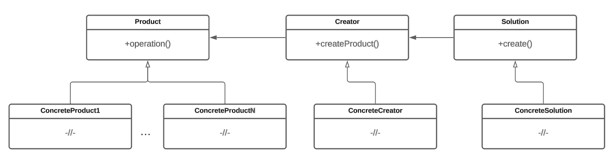

# Фабричный метод

## Назначение

Фабричный метод (Factory method) - порождающий шаблон проектирования, определяющий общий интерфейс создания объектов в родительском классе и позволяющий изменять создаваемые объекты в дочерних классах. Шаблон позволяет классу делегировать создание объектов подклассам. Используется когда заранее не известны типы объектов, с которыми должен работать код. Использование этого шаблона помогает избавить код от явного создания конкретных объектов (от оператора new). Вместо этого, код будет работать с абстрактными интерфейсом фабричного метода, который реализуют его наследники.

## Решаемые задачи

* Отделение принятия решения какой объект нужно создать от самого процесса создания объекта

Решение о выборе конкретного типа объекта принимается в части кода, который использует фабричный метод. Во время выполнения этот код определяет, какой тип объекта требуется создать, и вызывает соответствующий фабричный метод. Фактическое создание объекта происходит внутри фабричного метода.

* Возможность создавать и подменять объекты

Появляется возможность создавать объекты без привязки к конкретным классам. Это позволяет легко расширять, модифицировать или добавлять новые объекты, не изменяя другие части кода, которые используют эти объекты.

* Повторное использование объектов

Появляется возможность повторного использования одних и тех же объектов, которые были созданы в разных местах программы.

## UML диаграмма

<div data-full-width="true">

<figure><figcaption><p>UML диаграмма паттерна "Фабричный метод"</p></figcaption></figure>

</div>

## Общая реализация на языке с++




```cpp
class Product
{
public:
      virtual ~Product() = 0;
      
      virtual void run() = 0;
};
 
Product::~Product() {}
```





```cpp
class Creator
{
public:
      virtual ~Creator() = 0;
      
      virtual unique_ptr<Product> createProduct() = 0;
};

Creator::~Creator() = default;
```





```cpp
template <typename Tprod>
class ConcreteCreator : public Creator
{
public:
      virtual unique_ptr<Product> createProduct() override
      {
            return unique_ptr<Product>(new Tprod());
      }
};  
```





```cpp
class ConcreteProduct1 : public Product
{
public:
      virtual ~ConcreteProduct1() override 
      {
            cout << "Destructor;" << endl; 
      }
      
      virtual void run() override 
      { 
            cout << "Method run;" << endl;
      }
      
      unique_ptr<Creator> createConcreteCreator()
      {
            return unique_ptr<Creator>(new ConcreteCreator<ConcreteProduct1>());
      }
};
```





Класс Solution предоставляет метод для регистрации в данном случае Creator'ов для карты (map), состоящий из пар (pair): ключ + значение.



```cpp
class Solution
{
public:
      typedef unique_ptr<Creator> (*CreateCreator)();
 
      bool registration(size_t id, CreateCreator createfun)
      {
            return callbacks.insert(CallBackMap::value_type(id, createfun)).second;
      }
      
      bool check(size_t id) 
      { 
            return callbacks.erase(id) == 1; 
      }

      unique_ptr<Creator> create(size_t id)
      {
            CallBackMap::const_iterator it = callbacks.find(id);
 
            if (it == callbacks.end())
            {
//                throw IdError();
            }
            return unique_ptr<Creator>((it->second)());
      }
private:
      using CallBackMap = map<size_t, CreateCreator>;
      
      CallBackMap callbacks;
};
```





```cpp
# include <iostream> 
# include <memory> 
# include <map> 

using namespace std; 

int main()
{
      Solution solution;
      solution.registration(1, createConcreteCreator);
      shared_ptr<Creator> cr(solution.create(1));
      shared_ptr<Product> ptr = cr->createProduct();
      ptr->run();
}
```


## Общая реализация на языке Kotlin

#### Реализация классов машин




```kotlin
interface ICar {
    val model: String
    fun drive()
    fun getDescription(): String
}
```





```kotlin
class Audi: ICar {
    override val model: String = "A7"
    override fun drive() {
        println("Rides like an iron")
    }

    override fun getDescription(): String = "Brand: Audi, model: A7, revision: ${this.hashCode()}"
}
```





```kotlin
class Bmw: ICar {
    override val model: String = "3 series"

    override fun drive() {
        println("No one knows when the driver will change lanes")
    }

    override fun getDescription(): String = "Brand: Bmw, model: 3 series, revision: ${this.hashCode()}"
}
```





```kotlin
open class Bugatti protected constructor(): ICar {
    override val model: String = "Chiron"

    override fun drive() {
        println("Drive like a boss")
    }

    override fun getDescription(): String = "Brand: Bugatti, model: Chiron, revision: ${this.hashCode()}"
}
```




#### Реализация классов фабрики машин




```kotlin
abstract class CarFactory {
    abstract fun createCar(): ICar
}
```





```kotlin
class AudiFactory: CarFactory() {
    override fun createCar(): Audi = Audi()
}
```





```kotlin
class BmwFactory: CarFactory() {
    override fun createCar(): Bmw {
        return Bmw()
    }
}
```





```kotlin
class BugattiFactory : CarFactory() {
    override fun createCar(): Bugatti {
        class ConcreteBugatti : Bugatti()
        return ConcreteBugatti()
    }
}
```





```kotlin
fun main() {
    val audi = Audi() // можно создавать объект там где необходимо
    val audiFactory: CarFactory = AudiFactory()
    val audi1 = audiFactory.createCar()
    println(audi1.getDescription())
    audi1.drive()

    val audi2 = audiFactory.createCar()
    println(audi2.getDescription())
    audi2.drive()

    val bmw = Bmw() // можно создавать объект там где необходимо
    val bmwFactory: CarFactory = BmwFactory()
    val bmw1 = bmwFactory.createCar()
    println(bmw1.getDescription())
    bmw1.drive()

//    val bugatti = Bugatti() // ошибка компиляции, нельзя вызвать protected constructor
    val bugattiFactory = BugattiFactory()
    val bugatti1: Bugatti = bugattiFactory.createCar()
    println(bugatti1.getDescription())
    bugatti1.drive()

    val bugatti2: Bugatti = bugattiFactory.createCar()
    println(bugatti2.getDescription())
    bugatti2.drive()
}
```


## Преимущества

1. Избавляение от необходимости создания конкретного объекта в коде.
2. Создание объектов в одном месте упрощает поддержку и изменение кода.
3. Возможность во время выполнения программы принимать решение, какой объект создавать.
4. Возможность во время выполнения программы подменять создание одного объекта на другой.
5. Упрощается добавление новых классов без изменения написанного кода.

## Недостатки

1. Увеличение количества кода за счёт появления параллельных иерархий классов, усложнение разработки и проектирования.
2. Увеличение времени компиляции и исполнения.
3. Необходимость перекомплиировать один и тот же код при добавлении новых типов объектов.

## Связь с другими паттернами

* Фабричный метод может быть использован внутри [Абстрактной фабрики](../abstract-factory.md) для создания конкретных объектов. Вместо того, чтобы создавать объекты напрямую, Абстрактная фабрика может использовать Фабричный метод для создания экземпляров объектов определенного типа.
* Фабричный метод может быть использован для создания [прототипов](../prototype.md) объектов вместо создания новых объектов с помощью конструктора. Вместо создания объекта с нуля, Фабричный метод может использовать существующий объект-прототип и его клонирование для создания новых экземпляров. Это позволяет избежать накладных расходов на создание объектов с нуля и обеспечивает гибкость при создании новых объектов на основе существующих.
