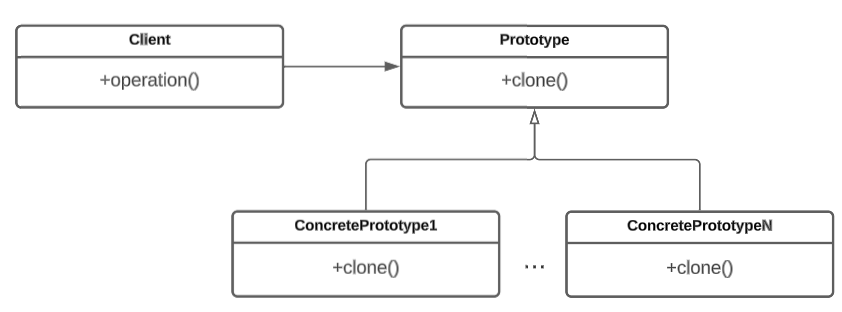

# Прототип

## Проблемы

Представим, что вам потребовалось создать каркасную модель сферы из полигонов. Обычно таких полигонов очень много и при их создании необходимо вычислять координаты. Кроме того, в методы для создания объектов требуется передавать объект класса Creator ([зачем нужен?](../factory-method/#naznachenie)). Более простым способом создания объекта может быть его копирование из существующего.&#x20;

В итоге:

* Необходимость передачи объекта класса Creator в методы для создания объектов
* Необходимость большого количества информации и времени для создания нового объекта

## Назначение

Прототип (Prototype) — это порождающий паттерн проектирования, который поручает создание копий объектов самим копируемым объектам. Для этого в базовый класс добавляется метод для копирования, который создает новый объект на основе существующего. Паттерн вводит общий интерфейс для всех объектов, поддерживающих копирование. Это позволяет копировать объекты, не привязываясь к их классам.

## Решаемые задачи

* Копирование объектов

Дает возможность создавать копии объектов на основе других объектов.

* Создание сложных объектов

Паттерн прототип предоставляет альтернативу созданию подклассов для конструирования сложных объектов. Вместо того, чтобы создавать множество подклассов для каждой вариации объекта, можно использовать прототипы и копирование, чтобы создавать новые объекты с нужными параметрами и состоянием.

## UML диаграмма

<figure><figcaption>
UML диаграмма паттерна "Прототип"
</figcaption></figure>

## Преимущества

1. Возможность создавать новые объекты, используя уже существующие объекты в качестве прототипов.
2. Увеличение скорости создания сложных объектов.
3. Нет необходимости в передаче объекта класса Creator в методы для создания объектов.

## Недостатки

1. Необходимо убедиться в добавлении метода копирования в каждый класс, объект которого может быть скопирован.
2. Копируется внутреннее состояние объекта, в том числе значения приватных полей.

## Связь с другими паттернами

1. Паттерн [Строитель](../builder/) может использовать прототипы для создания копий подобъектов.
