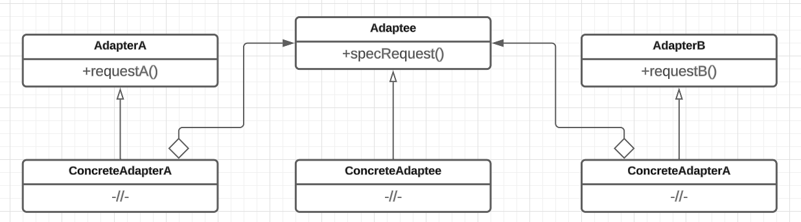

# Адаптер

## Назначение

Паттерн адаптер (Adapter) преобразует интерфейс одного класса в интерфейс другого, который ожидают клиенты. Адаптер обеспечивает совместную работу классов с несовместимыми интерфейсами, которая без него была бы невозможна.


Контейнеры queue, priority\_queue и stack библиотеки стандартных шаблонов STL реализованы на базе последовательных контейнеров list, deque и vector, адаптируя их интерфейсы к нужному виду. Именно поэтому эти контейнеры называют контейнерами-адаптерами.


## Решаемые задачи

* Разделение ответственностей

Согласно принципу единственной ответственности (Single Responsibility) один класс должен иметь одну область ответственности. Когда существует сущность на которую возложены 2 или более ответственностей, они разделяются посредством вынесения каждой в адаптер. Ответственности делаются независимыми друг от друга.

* Подмена одного интерфейса на другой

Позволяет преобразовывать интерфейс одного класса в интерфейс другого, который ожидают клиенты.


Интерфейс является абстракцией, которая определяет, как объект может быть использован, независимо от его конкретной реализации. Он представляет из себя набор методов и свойств класса.


* Использование сторонних библиотек

Использовать класс из нестандартной библиотеки следует через адаптер. Делается это для решения проблем совместимости интерфейсов библиотеки и рабочей среды, адаптации кода к новым версиям библиотеки, устранения сильной зависимости кода от библиотеки. Возможность контролировать и модифицировать адаптер делает код более гибким и легким в сопровождении.

* Расширение базового интерфейса


Интерфейс базового класса в общем случае плохо расширять, так как нарушаются приницпы инкапсуляции и единственной ответственности (Single Responsibility). Код становится тяжелее поддерживать и модифицировать. Появляется потребность в дополнительных проверках и приведениях типов при работе с указателями на базовый класс.



При использовании адаптера расширение может относиться не к одному классу, а к целой иерархии классов.


## UML диаграмма

<div data-full-width="true">

<figure><figcaption><p>UML диаграмма паттерна "Адаптер"</p></figcaption></figure>

</div>

## Общая реализация на языке С++




```cpp
// подключаем нужные для работы программы библиотеки
# include <iostream>
# include <memory>

// подключаем пространство имен std
using namespace std;
```





```cpp
// класс BaseAdaptee является базовым описанием интерфейса, 
// который нуждается в адаптации
 
class BaseAdaptee
{
public:
    virtual ~BaseAdaptee() = default;
    virtual void specificRequest() = 0;
};
```





```cpp
// класс ConcreteAdaptee определяет существующий интерфейс, 
// который нуждается в адаптации
// (реализует адаптируемый интерфейс) 

class ConcreteAdaptee : public BaseAdaptee
{
public:
    virtual void specificRequest() override 
    { 
        cout << "Method ConcreteAdaptee;" << endl; 
    }
};
```





```cpp
// Adapter - базовый абстрактный класс для адапетров

// Adapter адаптирует интерфейс Adaptee к зависящему от 
// предметной области интерфейсу, которым пользуется Client

// Client - сущность, которая вступает во взаимоотношения с объектами, 
// удовлетворяющими интерфейсу
 
class Adapter
{
public:
    virtual ~Adapter() = default;
    virtual void request() = 0;
};
```





```cpp
// конкретная реализация экзмпляра BaseAdapter

// ConcreteAdapter адаптирует интерфейс BaseAdaptee к интерфейсу Adapter,
// чтобы клиентский код мог использовать адаптируемый класс через адаптер

class ConcreteAdapter : public Adapter
{
private:
    shared_ptr<BaseAdaptee>  adaptee;
public:
    ConcreteAdapter(shared_ptr<BaseAdaptee> ad) : adaptee(ad) {}
    void request() override;
};

# pragma region Methods
void ConcreteAdapter::request()
{
    cout << "Adapter: ";
    if (adaptee)
    {
        adaptee->specificRequest();
    }
    else
    {
        cout << "Empty!" << endl;
    }
}
```





```cpp
int main()
{
    shared_ptr<BaseAdaptee> adaptee = make_shared<ConcreteAdaptee>();
    shared_ptr<Adapter> adapter = make_shared<ConcreteAdapter>(adaptee);

    adapter->request();
}
```


## Преимущества

* отделяет и скрывает от клиента подробности преобразования различных интерфейсов
* позволяет адаптировать интерфейс к требуемому
* позволяет разделить роли сущности
* дает возможность независимо развивать различные ответственности сущности
* расширение интерфейса

## Недостатки

* необходимость плодить много классов приводит к увеличению количества времени и памяти,необходимых для исполнения программы
* дублирование кода (в различных конкретных адаптерах может требоваться одна и та же реализация методов)
* часто адаптер должен иметь доступ к реализации класса

## Связь с другими паттернами

* [Мост](../bridge.md): структура паттерна мост аналогична структуре адаптера, но у моста иное назначение. Он отделяет интерфейс от реализации, чтобы то и другое можно было изменять независимо. Адаптер же призван изменить интерфейс существующего объекта.
* [Фасад](../facade.md): адаптер может использоваться внутри фасада для обеспечения совместимости между подсистемами, имеющими несовместимые интерфейсы.
* [Заместитель](../proxy.md): адаптер может служить в качестве простого заместителя для объекта, предоставляя тот же интерфейс, но с другой реализацией.
* [Декоратор](../dekorator.md): оба паттерна имеют схожую структуру, но разные цели. Адаптер изменяет интерфейс объекта, в то время как декоратор расширяет функциональность объекта, не изменяя его интерфейса
