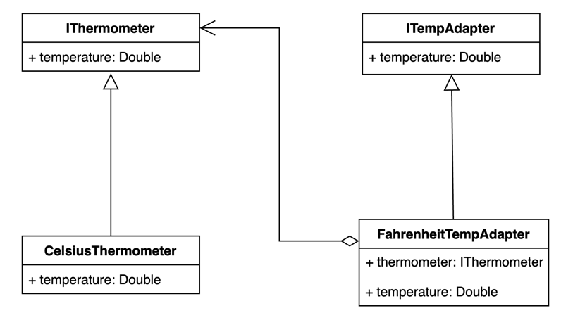

# Реализации на Kotlin

## UML диаграмма

<figure><figcaption><p>UML диаграмма для общей реализации паттерна "Адаптер" на Kotlin</p></figcaption></figure>

## Общая реализация на языке Kotlin




```kotlin
interface IThermometer {
    val temperature: Double
}
```





```kotlin
class CelsiusThermometer : IThermometer {
    override val temperature: Double = DEFAULT_TEMPERATURE

    companion object {
        private const val DEFAULT_TEMPERATURE: Double = 15.0
    }
}
```





```kotlin
interface ITempAdapter {
    val temperature: Double
}
```





```kotlin
class FahrenheitTempAdapter(
    private val thermometer: IThermometer
) : ITempAdapter {
    override val temperature: Double = thermometer.temperature * FACTOR + LINEAR_COEFFICIENT

    companion object {
        private const val FACTOR = 1.8
        private const val LINEAR_COEFFICIENT = 32.0
    }
}
```





```kotlin
fun main() {
    val thermometer: IThermometer = CelsiusThermometer()
    println("Temperature in celsius: ${thermometer.temperature}")
    val adapter: ITempAdapter = FahrenheitTempAdapter(thermometer)
    println("Temperature in fahrenheit: ${adapter.temperature}")
}
```

