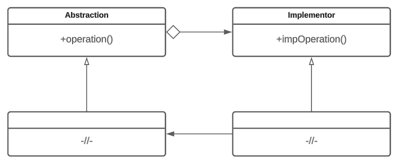

# Мост

## Назначение

Мост (Bridge) - структурный паттерн, предназначенный для отделения абстракции от ее реализации так, чтобы была возможность изменять их независимо друг от друга.

## Решаемые задачи

* возможность выбирать реализацию во время выполнения программы

Мост позволяет избежать постоянной привязки абстракции к реализации.

* комбинирование разных абстракций и реализаций и изменение их независимо
* избежание перекомпиляции клиентского кода при изменениях в реализации абстракции
* полное сокрытие от клиентов реализации абстракции
* разделение одной реализации между несколькими объектами и сокрытие деталей разделения от клиента
* декомпозиция иерархии: позволяет управлять ростом и сложностью иерархии


Зачастую иерархию разделяют на две части: абстракцию и реализацию.

В некоторых случаях может потребоваться более чем две части для разделения иерархии на более гибкие и независимые компоненты. Количество частей зависит от конкретных требований и особенностей системы.


## UML диаграмма

<figure><figcaption>
UML диаграмма паттерна "Мост"
</figcaption></figure>

## Преимущества

* избавление от дублирования кода


Дублирование кода может возникать в случае, когда несколько реализаций содержат одинаковые методы. Данную проблему можно решить вынесением одинаковых методов на более высокий уровень абстракции. Однако такой подход вынуждает реализовывать вынесенные методы во всех остальных экземплярах реализации


* позволяет иерархии не разрастаться
* сокрытие деталей реализации от клиентов
* возможность изменять реализацию во время выполнения программы

## Недостатки

* увеличение времени выполнения
* тяжелый процесс реализации паттерна: введение дополнительного уровня абстракции между "реализацией" и "абстракцией"

Из-за дополнительных затрат на разработку паттерна и усложнения структуры кода появляется необходимость закладывать реализацию моста в систему на этапе проектирования

* связь между абстрактными понятиями не всегда может быть выделена

## Связь с другими паттернами

* [Абстрактная фабрика](../../creationals-patterns/abstract-factory/): паттерн абстрактная фабрика может создать и сконфигурировать мост
* [Адаптер](../adapter/): для обеспечения совместной работы не связанных между собой классов прежде всего предназначен паттерн адаптер. Обычно он применяется в уже готовых системах. Мост же участвует в проекте с самого начала и призван поддерживать возможность независимого изменения абстракций и их реализаций.
* [Компоновщик](../composite/): мост и компоновщик могут совместно использоваться для создания сложных структур, состоящих из связанных объектов.
* [Декоратор](../dekorator/): мост может быть комбинирован с декоратором для добавления дополнительной функциональности к объектам абстракции и реализации.
* [Стратегия](../../behavioral-patterns/strategy/): мост может быть реализован с использованием стратегии. В этом случае, абстракция содержит ссылку на объект стратегии, который предоставляет конкретную реализацию. Стратегия может быть легко заменена другой, не нарушая интерфейса абстракции.
