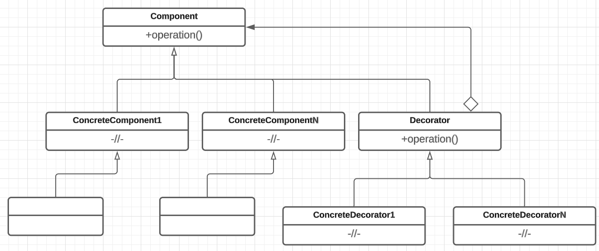

# Декоратор

## Назначение

* Паттерн декоратор (Decorator) позволяет динамически добавлять новые обязанности объекту. Декораторы являются гибкой альтернативой порождению подклассов для расширения функциональности.
* Рекурсивно декорирует основной объект.

Предполагает возможность применять несколько декораторов последовательно, оборачивая один декоратор в другой. Каждый декоратор добавляет свою функциональность к объекту, а затем передает управление следующему декоратору в цепочке, пока не достигнет последнего.

* Паттерн декоратор использует схему "обертываем подарок, кладем его в коробку, обертываем коробку".

## Решаемые задачи

* динамическое, прозрачное для клиентов добавление обязанностей объектам
* реализация обязанностей, которые могут быть сняты с объекта
* применяется, когда расширение путем наследования по каким-то причинам неудобно или невозможно


Наследование от некоторых классов может быть запрещено.


## UML диаграмма

<div data-full-width="true">

<figure><figcaption><p>UML диаграмма паттерна "Декоратор"</p></figcaption></figure>

</div>

## Общая реализация на языке С++




```cpp
# include <iostream>
# include <memory>

using namespace std;
```





```cpp
class Component
{
public:
    virtual ~Component() = default;
    virtual void operation() = 0;
};
```





```cpp
class ConcreteComponent : public Component
{
public:
    void operation() override 
    { 
        cout << "ConcreteComponent; "; 
    }
};
```





```cpp
class Decorator : public Component
{
protected:
    shared_ptr<Component> component;
public:
    Decorator(shared_ptr<Component> comp) : component(comp) {}
};
```





```cpp
class ConcreteDecorator : public Decorator
{
public:
    using Decorator::Decorator;
    void operation() override;
};

# pragma region Method
void ConcreteDecorator::operation()
{
    if (component)
    {
        component->operation();
        cout << "ConDecorator; ";
    }
}
# pragma endregion
```





```cpp
int main()
{
    shared_ptr<Component> component = make_shared<ConcreteComponent>();
    shared_ptr<Component> decorator1 = make_shared<ConcreteDecorator>(component);

    decorator1->operation();
    cout << endl;

    shared_ptr<Component> decorator2 = make_shared<ConcreteDecorator>(decorator1);

    decorator2->operation();
    cout << endl;
}
```


## Преимущества

* Гибкость: возможность добавлять желаемую реализацию к любому классу. Появлется возможность "декорировать" декораторы.
* Отсутсвие разрастания иерархии.
* Позволяет избежать перегруженных функциями классов на верхних уровнях иерархии.
* Возможность обращаться с декорированным объектом так же как и с исходной сущностью.
* Отсутствие дублирования кода, данный код просто уходит в конкретный декоратор.

## Недостатки

* Снижение производительности программы.

Не используя декораторы можно напрямую пользоваться методом класса. Декоратор же может долго полиморфно совершать цепочку вызовов, что сказывается на времени выполнения программы.

* Вся ответственность за декорирование "ложится на плечи" программиста

Нет сущности, которая бы полностью отвечала за последовательность декорирования: за порядок вызова и оборачивания декораторов

* В случае если в цепочке вызовов декоратора появляется необходимость изменить какую-либо обертку или удалить ее, то приходится заново оборачивать исходный объект.
* Необходимость в создании сущности, отвечающей за декорирование.

## Связь с другими паттернами

* [Компоновщик](composite.md): декоратор можно рассматривать как вырожденный случай компоновщика с единственным компонентом. Однако Decorator добавляет новые обязанности и не предназначен для агрегирования объектов.
* [Стратегия](../behavioral-patterns/strategy.md): декоратор хорошо совмещается с паттерном стратегия. Декоратор позволяет изменить внешний облик объекта, стратегия – его внутреннее содержание. Это два взаимодополняющих способа изменения объекта.
* [Адаптер](adapter.md): если декоратор изменяет только обязанности объекта, но не его интерфейс, то адаптер придает объекту совершенно новый интерфейс.
