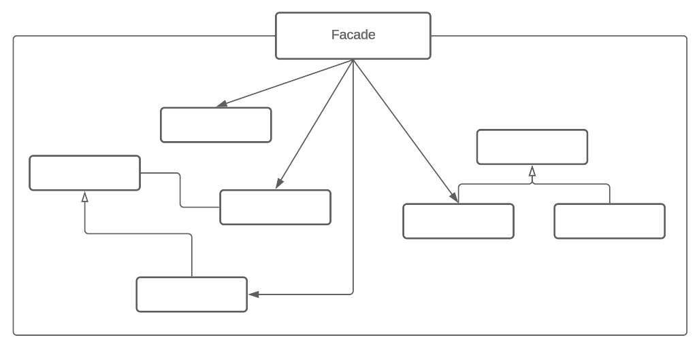

# Фасад

## Назначение

Паттерн фасад (Facade) относится к структурным шаблонам проектирования и предоставляет унифицированный интерфейс вместо набора интерфейсов некоторой подсистемы. Он определяет интерфейс более высокого уровня, который упрощает использование подсистемы.

## Решаемые задачи

* предоставление простого интерфейса к сложной подсистеме
* ослабление связей между компонентами системы

## UML диаграмма

<figure><figcaption>
UML диаграмма паттерна "Фасад"
</figcaption></figure>

## Преимущества

* упрощение взаимодействия: предоставление простого интерфейса к сложной подсистеме
* снижение зависимости клиентского кода от подсистемы: работа происходит с одним объектом

## Недостатки

* увеличение сложности и сопровождаемости фасада

Если подсистема имеет большое количество компонентов или сложную структуру, фасад рискует стать сложным, перегруженным объектом, что приведет к укреплению связей между компонентами вместо их ослабления.

## Связь с другими паттернами

* [Абстрактная фабрика](../../creationals-patterns/abstract-factory/): допустимо использовать вместе с фасадом, чтобы предоставить интерфейс для создания объектов подсистем способом, не зависимым от этих подсистем. Абстрактная фабрика может выступать и как альтернатива фасаду, чтобы скрыть платформенно-зависимые классы.
* [Посредник](https://github.com/NikkiWay/Git-Book-Patterns/blob/main/patterns/behavioral-patterns/opekun.md): аналогичен фасаду в том смысле, что абстрагирует функциональность существующих классов.
* [Одиночка](../../creationals-patterns/singleton/): обычно требуется только один фасад. Поэтому объекты фасадов часто бывают одиночками.
* [Подписчик-издатель](../../behavioral-patterns/follower-publisher/): фасад может применять паттерн наблюдатель для уведомления клиентов о событиях, происходящих в подсистеме.
* [Компоновщик](../composite/): фасад может использовать компоновщик для предоставления единого интерфейса к группе объектов внутри подсистемы.
* [Адаптер](../adapter/): фасад может использовать адаптеры для преобразования интерфейсов подсистемы в интерфейс, ожидаемый клиентом
