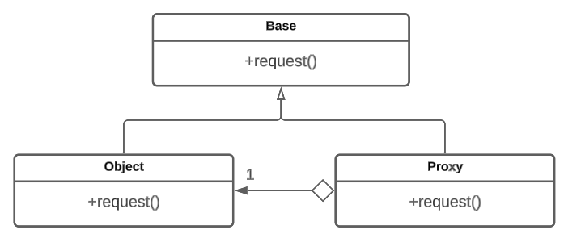

# Заместитель

## Назначение

Паттерн проектирования заместитель (Proxy) имитирует интерфейс и поведение оригинального объекта и контролирует доступ к нему.


Заместитель обычно создается для того, чтобы предоставить дополнительные функции или управлять доступом к оригинальному объекту без изменения его основной логики или структуры.


Назначение паттерна заместитель заключается в добавлении дополнительного уровня абстракции между клиентом и реальным объектом.

## Решаемые задачи

* предоставление локального объекта, который работает с удаленным объектом, скрывая детали удаленного взаимодействия \[удаленный заместитель (Remote Proxy)]
* создание заглушки для ресурсоемкого объекта, позволяющей откладывать его создание или загрузку до момента реального использования \[виртуальный прокси (Virtual Proxy)]
* контроль доступа к объекту, ограничение различных операций в зависимости от прав доступа \[защищающий заместитель (Protection Proxy)]
* выполнение дополнительных действий при доступе к объекту, например, подсчет ссылок на объект или отслеживание изменений \["умная" ссылка (Smart Reference)]
* кэширование результатов операций объекта для избегания повторных вычислений или загрузки \[кэширующий заместитель (Caching Proxy)]

## UML диаграмма

<figure><figcaption>
UML диаграмма паттерна "Заместитель"
</figcaption></figure>

## Преимущества

* контроль доступа к объекту


Позволяет реализовать механизмы безопасности, аутентификации и авторизации в системе.


* возможность работы при отсутствии самого объекта


В этом случае поведение заместителя может быть неоднозначным. Необходимо предупреждение о возможной недостоверности ответа


* упрощение работы с ресурсоемкими объектами, "разгрузка" тяжелого оригинального объекта
* добавление дополнительного функционала перед или после обращения к оригинальному объекту
* возможность отвечать за жизненный цикл объекта
* кэширование: возможность хранить результаты операций и предоставлять их повторно без обращения к оригинальному объекту

## Недостатки

* увеличение накладных расходов: увеличение времени выполнения операций
* усложнение кода: необходимость в добавлении дополнительных классов и методов

## Связь с другими паттернами

* [Адаптер](../adapter/): предоставляет другой интерфейс к адаптируемому объекту. Напротив, заместитель в точности повторяет интерфейс своего субъекта.


Интерфейс заместителя может быть и подмножеством интерфейса субъекта.


* [Декоратор](../dekorator/): реализация паттерна декоратор похожа на реализацию заместителя, но назначение совершенно иное. Декоратор добавляет объекту новые обязанности, а заместитель контролирует доступ к объекту.
* [Фабричный метод](../../creationals-patterns/factory-method/): заместитель может быть создан с помощью фабричного метода. Фабричный метод позволяет инкапсулировать процесс создания заместителя и предоставляет гибкость в выборе типа заместителя, который будет создан.
* [Одиночка](../../creationals-patterns/singleton/): заместитель может быть реализован как одиночка, гарантируя, что будет создан только один объект заместителя для доступа к оригинальному объекту
* [Стратегия](../../behavioral-patterns/strategy/): заместитель может использоваться для введения различных стратегий доступа к объекту.
